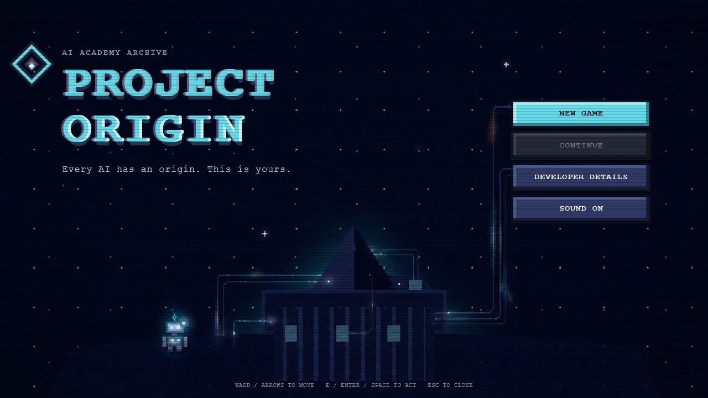

# PROJECT ORIGIN

> **Every AI has an origin. This is yours.**



**PROJECT ORIGIN** is a story-driven, 2D pixel-art educational RPG that turns the foundations of artificial intelligence into playable experiences. You control ORI, an obsolete service robot that awakens with its intelligence modules missing and follows a weak signal to an abandoned AI Academy.

Restore Computer Vision, Machine Learning, Natural Language Processing, and Deep Learning; explore the history of AI; then follow the restored signal into the sealed Research complex and ARCHIVE ZERO.

| | |
|---|---|
| **Format** | Browser-based 2D pixel RPG |
| **Playtime** | Approximately 20–30 minutes |
| **Languages** | English and Simplified Chinese |
| **Platforms** | Desktop browser and installable mobile PWA |
| **Runtime** | Fully client-side; no backend or account required |
| **Stack** | React, TypeScript, Vite, CSS pixel art, Web Audio |

## **Built with Codex & GPT-5.6**

> [!IMPORTANT]
> **PROJECT ORIGIN was built through iterative human–AI collaboration, with Codex powered by GPT-5.6 used as a repository-aware engineering partner throughout development.**

Codex and GPT-5.6 were used to:

- turn gameplay briefs, sketches, screenshots, and visual feedback into scoped implementation work;
- build and refactor the React/TypeScript state machine, scenes, Lab activities, save migrations, bilingual UI, mobile controls, PWA shell, and procedural audio systems;
- translate art direction into original DOM/CSS pixel environments without a game engine or downloaded game assets;
- diagnose interaction and responsive-layout issues across desktop and mobile landscape play;
- write and run automated tests for progression, validation, persistence, and legacy-save compatibility;
- perform browser-based visual QA, including touch interaction, map traversal, atmosphere timing, and responsive checks;
- maintain the project specification, implementation status, and technical documentation as the game evolved.

The project was **not produced from a single prompt**. Ethan Lim directed the concept, learning goals, game structure, art direction, content, and final product decisions through repeated review-and-revision cycles. Codex implemented and verified changes under that direction, while GPT-5.6 supplied the reasoning and coding capability behind the collaboration.

### No runtime AI dependency

The shipped game does **not** call GPT-5.6, Codex, or any external AI API. Its activities are transparent, deterministic teaching simulations that run locally in the browser. Progress is stored in `localStorage`, and the production PWA can load its application shell offline.

## The experience

```text
Origin Sequence
      ↓
AI Academy Hub ──→ Research Complex ──→ ARCHIVE ZERO
      |
      ├── Computer Vision Lab
      ├── Machine Learning Lab
      ├── Natural Language Processing Lab
      ├── Deep Learning Lab
      |
      └── AI History Events ──→ People of AI Gallery
```

The Academy begins in a quiet, damaged night state. Restoring modules changes both ORI and the world: vision unlocks daylight, later Labs cycle the campus through different sky periods, systems reactivate, language returns, and the final Research route comes online.

### Four playable Labs

- **Computer Vision** — image classification, visual differences, object localization, and an autonomous-driving labeling challenge.
- **Machine Learning** — supervised examples, decision boundaries, decision trees, and factory quality prediction.
- **Natural Language Processing** — tokenization, next-word prediction, semantic relationships, and a Transformer archive challenge.
- **Deep Learning** — neural connections, signal flow, parameter tuning, and gradient descent.

Each Lab contains four ordered activities, immediate feedback, optional explanations, persistent progress, replay support, a themed mentor, and historical exhibits. The activities teach by interaction first and explain the idea after success.

### World and progression

- Compact, walkable AI Academy Hub with four distinct Lab buildings.
- Separate History Events and People of AI archive maps with curated records.
- Gated Research complex containing sealed future modules and the canonical ending.
- Day, dusk, night, lighting, particles, and a timed Research sandstorm.
- ORI visually gains restored vision, learning, communication, and neural-core modules.
- Completing NLP unlocks the `F` Voice ability with generated do/re/mi/fa/so tones.
- Original procedural chiptune music and sound effects generated with the Web Audio API.
- English and Simplified Chinese selectable from Home → Settings.
- Save-aware Continue, safe legacy-save migration, and post-ending free exploration.

## Controls

| Action | Desktop | Mobile |
|---|---|---|
| Move | `WASD` or arrow keys | Hold the virtual D-pad |
| Interact | `E`, `Enter`, or `Space` | Contextual action button |
| Voice | `F` after NLP is restored | Voice button |
| Close / return | `Esc` where available | On-screen close or return button |

Mobile gameplay is designed for landscape orientation. Touch controls support held movement, suppress browser selection/callouts, and respect safe areas. Standalone installation is available through the included web manifest.

## Run locally

### Requirements

- Node.js `20.19+` or `22.12+`
- npm

### Install and start

```bash
npm ci
npm run dev
```

Open the local URL printed by Vite, normally `http://localhost:5173/`.

### Verify

```bash
npm test
npm run build
```

`npm test` runs the Vitest suite. `npm run build` performs strict TypeScript checking before producing the optimized application in `dist/`.

Current verification: **18 test files and 96 tests passing**, with a successful production build.

## Technical design

- A reducer-driven game state machine owns progression, scenes, achievements, gates, named spawn points, and ending eligibility.
- Defensive storage migration keeps older saves playable as new systems are introduced.
- The entire game renders inside a fixed `960 × 540` logical frame that scales crisply to the available viewport.
- Maps, characters, buildings, effects, portraits, and interfaces are composed from original HTML/CSS pixel art.
- Audio is synthesized locally and starts only after a valid user gesture to respect browser autoplay rules.
- All gameplay remains accessible through keyboard and touch; blocking panels preserve close, focus, and return paths.

### Project structure

```text
src/
├── audio/          Procedural music, instruments, sequencing, and effects
├── components/     Shared viewport, portraits, controls, prompts, and UI
├── data/           Lab curriculum, maps, archive records, and answer helpers
├── game/           Reducer, state types, persistence, and interactions
├── hooks/          Movement, translation, voice, and input behaviors
├── i18n/           English/Simplified Chinese localization support
├── scenes/         Title, maps, Labs, Research, and ending sequences
├── styles/         Pixel-art scene, Lab, atmosphere, audio, and mobile styling
└── world/          Centralized atmosphere presets and rendering
```

More detail is available in the [product specification](./PROJECT_SPEC.md), [project status](./PROJECT_STATUS.md), and [world atmosphere documentation](./docs/world-atmosphere.md).

## Design principles

- **Playable before explainable** — introduce an AI idea through an action, then reveal the terminology.
- **A game, not a dashboard** — maps, buildings, progression, and story carry the learning experience.
- **Transparent simulations** — displayed predictions and scores never pretend to be live model inference.
- **Small but complete** — a focused journey with one canonical ending instead of an unfinished open world.
- **Original and local-first** — no copyrighted game assets, remote image dependency, backend, or account system.

## Creator

**Ethan Lim**  
AI Builder · Product-minded Developer  
Bachelor of Artificial Intelligence, Universiti Teknologi Malaysia  
Based in Malaysia

- [GitHub](https://github.com/ETHAN071104)
- [LinkedIn](https://www.linkedin.com/in/ethan-lim-462a833bb/)

PROJECT ORIGIN was designed and developed as a playable introduction to artificial intelligence—an experiment in making technical ideas understandable through interaction, atmosphere, and story.
